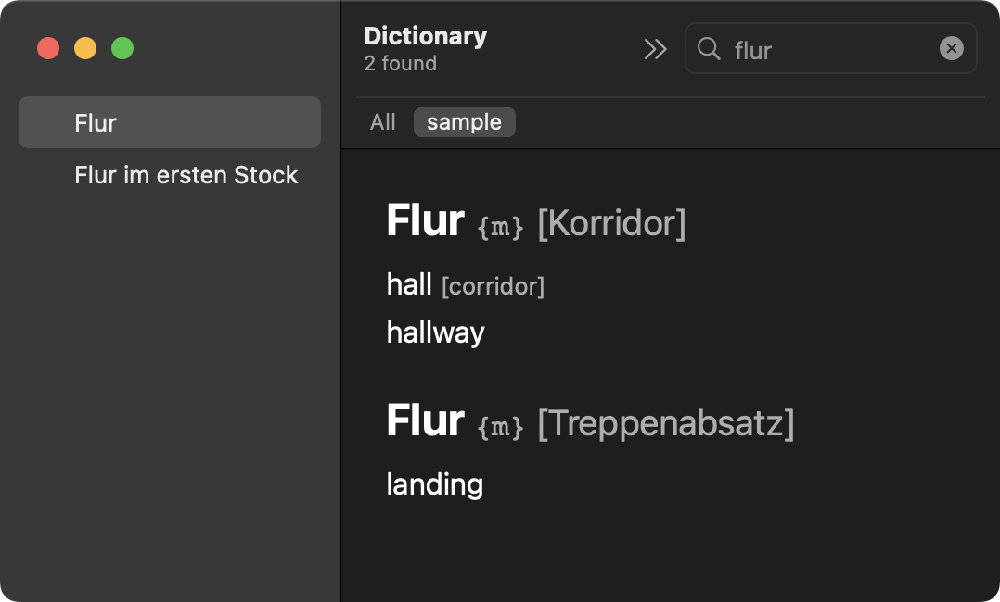
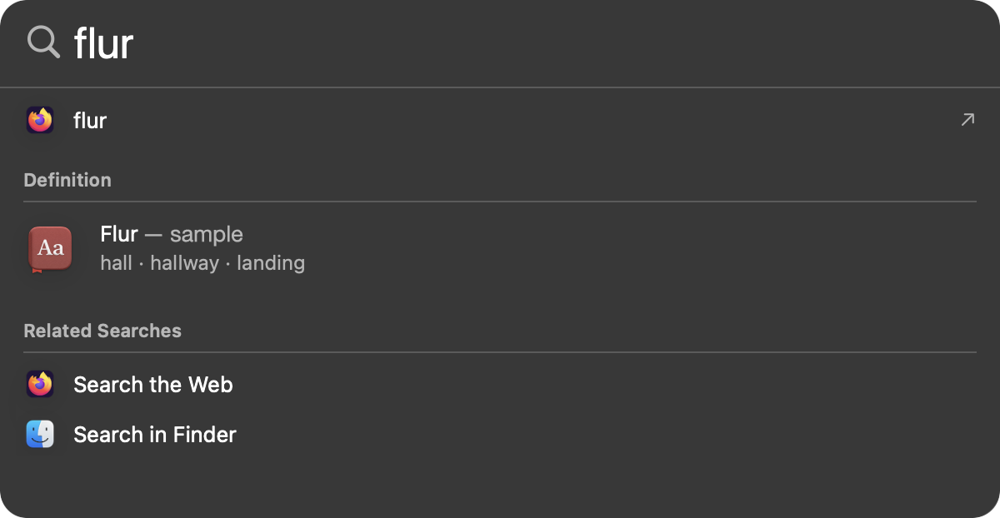

# macOS Dictionary Builder

Python script to convert a tabular text file into a macOS `.dictionary` bundle.



- Special feature: translations in Spotlight results




## Install

```sh
pip3 install macos-dictionary-builder
```


## Build your own dictionary

Download your own copy of the Vocabulary Database from [dict.cc](https://www1.dict.cc/translation_file_request.php?l=e).
Then run this script on the extracted txt file.


### Easy-usage script

Choose one, both of these are equivalent:

```sh
macos-dictionary-builder de-en.txt
```

```sh
python3 -m macos_dictionary_builder de-en.txt
```


### Python module usage

```python
from macos_dictionary_builder import parse, meta, devkit

# step 1: parse translation entries
with open('sample.txt', 'r') as fp:
    count = parse.makeDictXML(fp, 'data.xml')
    print(count, 'entries')

# step 2: create metadata
plist = meta.makeMetaPlistDict('bundleId', name='...', ...)
meta.writeMetaPlist('meta.plist', plist)

# step 3: create dictionary
devkit.callDevKitScript('Sample.dictionary', xml='data.xml', plist='meta.plist')
```

or call the individual modules separately:

```sh
python3 -m macos_dictionary_builder.parse sample.txt -o data.xml
python3 -m macos_dictionary_builder.meta meta.plist -b uid -n Sample ...
python3 -m macos_dictionary_builder.devkit Sample data.xml meta.plist
```


## About this project

I've been using the pre-compiled [dictionary by dict.cc](https://www.dict.cc/?s=about%3Awordlist).
My workflow: type a word into Spotlight and immediately get a translation for the word.
But ever since macOS 10.15 (or so), Spotlight stopped doing that.
The Spotlight entry would just show my searched word, but no translation.
Till now, I was forced to open the Dictionary app to see the translation.

So, after years of postponing, I finally found time to follow up on this project.
Initially, I hoped to rebuild a new dictionary with the old [python script by bernie43](https://github.com/bernie43/dictcc-macos-dictionary).
However, the script is very old (Python 2) and does not work anymore.
I've also seen the [new repo by LeChatParle](https://github.com/LeChatParle/dictcc-macos-dictionary) who ported the code to Python 3, but even this repo does not show the translation in Spotlight.

After a few modifications to the old code, I threw away everything and started from scratch.
My code is a bit more modular but still restricted to the dict.cc style of formatting (one line per translation).
E.g. the [beolingus](https://dict.tu-chemnitz.de/index.html.en) format won't work because each line contains multiple translations and plurals.

Future work: additional parsers for other formats.


## Dictionary Development Kit

This project relies on the [Dictionary Development Kit](https://developer.apple.com/download/all/?q=Dictionary%20Development%20Kit) by Apple.
The bundled version is extracted from `Additional Tools for Xcode 12.5` (latest for macOS 10.15).
If you want a newer version, download via the link above and place it in:

`~/.config/macos_dictionary_builder/Dictionary Development Kit`
